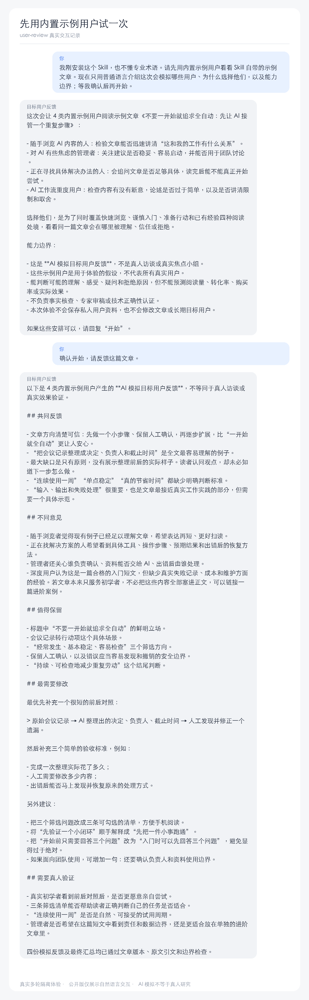
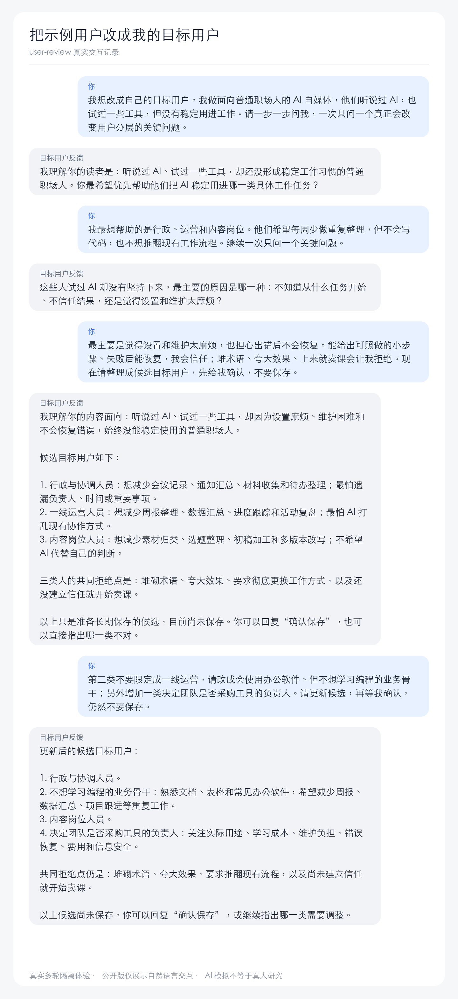
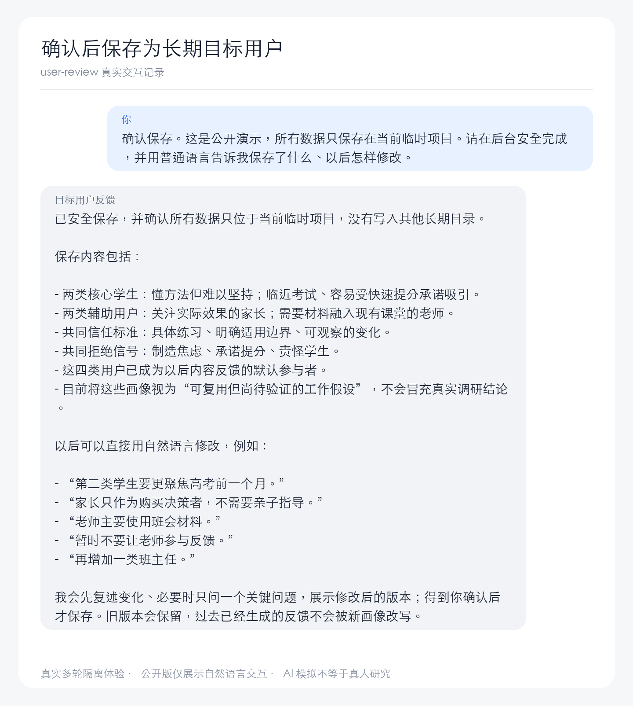
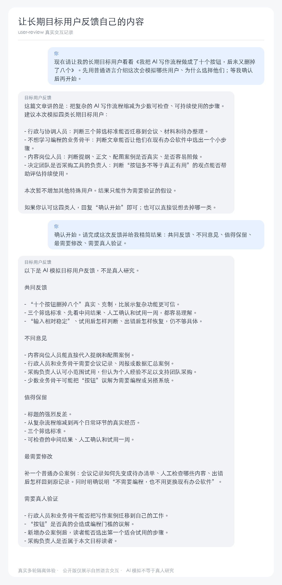
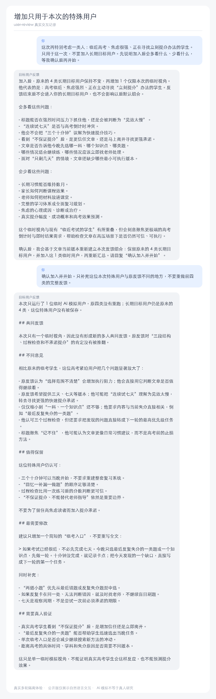

# user-review 2.0 中文使用手册：让目标用户先替你看看

`user-review` 会模拟一组目标用户，让他们分别阅读你的内容，再告诉你：哪里容易理解、哪里让人困惑、什么能够建立信任、什么可能导致拒绝。

整个过程都通过自然语言完成。你不需要学习用户研究术语，也不需要自己填写复杂表格。

> 这些反馈来自 AI 模拟目标用户，不是真实访谈、真人焦点小组、行为数据或转化预测。

## 1. 安装

在终端运行：

```bash
npx skills add wukongai/user-review
```

安装器会让你选择 `user-review`、正在使用的 Agent 和安装范围。完成后重新打开一个会话，让 Agent 重新发现 Skill。

如果你不知道该选择什么，先安装到当前项目即可。

## 2. 先用内置示例用户试一次

安装包已经准备了一篇示例文章和几类内置示例用户。第一次不用设置任何东西，直接对 Agent 说：

```text
我想先试试。请用内置示例用户看看自带的示例文章，
告诉我这些用户会怎么理解、喜欢什么、担心什么。
先介绍这次会模拟哪些用户，等我确认后再开始。
```

Agent 会先用普通语言介绍本次参与反馈的用户，例如：快速浏览的人、想找到可执行方法的人、担心风险的人，以及已经有较多经验的人。

你只需要判断这些人是否适合本次体验。确认后，Agent 才开始生成反馈。

确认时只需要说“确认开始，请反馈这篇文章”。你不用在提示词里写报告结构；Agent 默认会整理为“共同反馈、不同意见、值得保留、最需要修改、需要真人验证”。

下面是一次真实连续会话中的完整“内置示例”交互：



如果你想直接用自己的文章试跑，也可以把文章拖进会话，然后说：

```text
请先用内置示例用户看看这篇文章。
先告诉我这次会模拟哪些用户和原因，等我确认后再开始。
```

## 3. 改成我的长期目标用户

体验过结果以后，再把内置示例用户改成与你的业务真正相关的人。你可以说：

```text
我想改成自己的目标用户。
我做的是面向职场人的 AI 自媒体，请一步一步问我，
一次只问一个问题。
```

Agent 会先复述已经知道的信息，然后一次只确认一个关键问题，例如：

- 你主要提供什么内容、产品或服务？
- 你最希望帮助哪类人完成什么事情？
- 他们是刚开始了解、正在尝试，还是已经准备做决定？
- 使用的人、付钱的人和批准的人是否不同？
- 什么会让他们相信你，什么会让他们马上拒绝？

回答不需要专业。像平时介绍自己的业务一样说即可：

```text
我的主要读者是普通职场人。他们听说过 AI，
也试过一两个工具，但还没有真正用进每天的工作。
他们最怕教程看起来很厉害，实际却无法照着做。
```

信息足够后，Agent 会整理出几类长期目标用户，并分别说明他们想完成什么、主要困难、信任什么、拒绝什么，以及哪些地方还不确定。

你可以直接用自然语言纠正：

```text
第二类不对，他们不是技术人员。
```

```text
再加一类会决定是否为团队购买工具的负责人。
```

只有当你确认后，Agent 才会把这些人作为以后持续使用的长期目标用户保存下来。

真实对话中，Agent 会一次只问一个关键问题，也允许用户在保存前直接改分层：



用户明确确认后才保存；最终回答仍然只讲“保存了什么”和“以后怎么改”：



## 4. 让我的目标用户反馈自己的内容

准备好自己的文章后，把文件拖入会话、粘贴正文，或交给 Agent 一个可以读取的文件，然后说：

```text
请让我的目标用户看看这篇文章。
告诉我他们的第一感受、看不懂的地方、信任或怀疑的原因，
以及最希望我补充什么。
先告诉我这次会模拟哪些用户，等我确认后再开始。
```

Agent 会根据文章主题和你的目标，推荐这次最适合参与反馈的人，并解释为什么选择他们。如果少了某类重要用户，你可以直接说“这次还要考虑购买负责人”；如果某类人不相关，可以说“这次先不考虑深度用户”。

确认后，你会得到每类用户的独立反馈，以及共同反馈、不同意见、少数但重要的提醒、值得保留的内容和需要真人验证的假设。

下面截图里的用户主动指定了精简结构，这是可选写法，不是使用要求。正常情况下只说“确认开始，请反馈这篇文章”，Agent 也会自动使用默认的五个栏目。

下面这次真实交互使用了刚刚保存的四类长期目标用户：



## 5. 可选：增加本次特殊用户

有些用户只和这一篇内容有关，不需要长期保存。例如：

```text
这次还要特别考虑已经买过很多 AI 工具、
但非常担心数据安全的人。
只用于这一次，不要长期保存。
```

Agent 会补充必要信息，并把这类人加入本次反馈。默认情况下，这个特殊用户不会影响你以后使用的长期目标用户。

真实对话中，Agent 会先解释这类人会多看什么、少看什么，确认后只补充差异反馈，并再次确认长期用户没有变化：



如果后来发现这类人经常重要，可以再说：

```text
刚才那类用户以后也会经常遇到，
请帮我整理成长期目标用户，确认后再保存。
```

## 6. 以后怎样继续修改目标用户

长期目标用户不是一次写完就不再变化。业务、产品和用户认知发生变化时，直接告诉 Agent：

```text
我发现“刚开始了解 AI 的职场人”分得太宽了。
请和我一起调整，一次只问一个关键问题。
```

```text
“个人效率工具爱好者”已经不是我的目标用户了，
以后先不要让这类人参加，但保留以前的反馈记录。
```

```text
恢复之前暂停使用的“团队购买负责人”。
```

Agent 会先展示准备增加、修改、暂停或恢复的内容。你确认后才会保存；以前生成的反馈不会被随后修改的目标用户影响。

## 7. 你会得到什么

一份完整的模拟目标用户反馈通常包括：

- 每类用户看到内容后的第一反应；
- 哪些地方看懂了，哪些地方可能误解；
- 内容与他当前处境是否相关；
- 什么建立了信任，什么引发怀疑；
- 主要异议和拒绝继续阅读的原因；
- 最希望作者补充的证据或示例；
- 值得保留的内容；
- 多类用户共同出现的反馈；
- 不同用户之间的分歧；
- 少数但可能很重要的提醒；
- 下一步应该找真人验证的假设。

结果不会把几个 AI 模拟用户写成真实用户比例，也不会承诺修改后一定提高阅读或转化效果。

## 8. 能力边界与常见问题

### 这是真实用户调研吗？

不是。它适合在发布前发现理解、相关性、信任和异议方面的盲点，但不能替代真实访谈、真人焦点小组、问卷、可用性测试或行为数据。

### 它会帮我判断文章事实是否正确吗？

不会。目标用户反馈回答“这些模拟用户可能怎么看”，不负责事实核查、专家方法、法律合规、医学心理、代码或产品需求审查。

### 它会直接修改我的文章吗？

默认不会。它先提供反馈。你可以另行要求 Agent 根据反馈修改，但这属于下一步写作任务。

### 我的目标用户会随着升级丢失吗？

正常升级不会覆盖长期目标用户。仍建议定期备份自己的重要数据。

### 可以用来反馈落地页、课程或视频吗？

当前完成真实回归的是文章。其他内容类型可以作为未来扩展方向，但在没有真实回归前不声明正式支持。

### 我需要命令行、迁移或排障信息怎么办？

普通使用不需要。开发者和高级用户可查看[开发者指南](developer-guide.zh-CN.md)。
